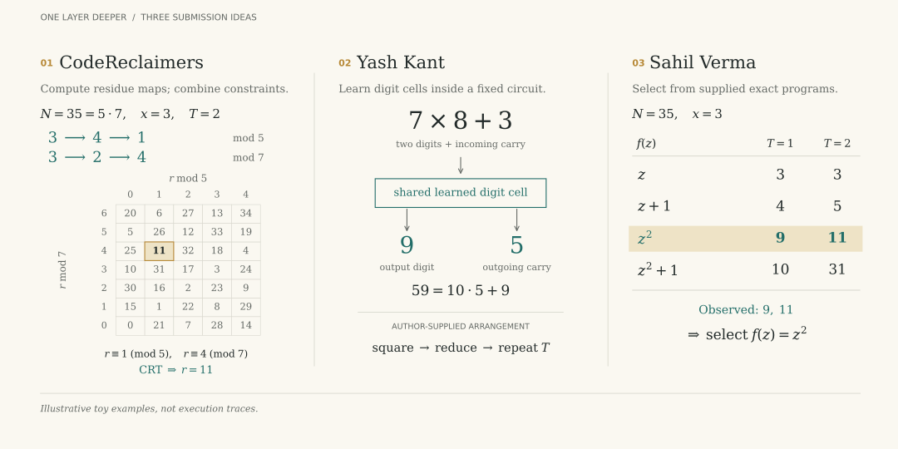

# We still don't know if the models want to learn

We archived **15,602 accepted uploads from 206 GitHub accounts** to One Layer Deeper.

## The intended challenge

The public problem is repeated modular squaring:

```python
z = x % N
for _ in range(T):
    z = z * z % N
```

Our [launch post](https://blog.tilderesearch.com/blog/one-layer-deeper) asked participants to design architectures, optimizers, and losses that learn this computation and use more internal steps at test time. Loops were allowed; supplying an arithmetic solver or generating training targets with one was prohibited.

Hard allowed one H100, one hour of training, 30 minutes of evaluation, and 500 million model-state elements, including buffers. Depth was unrestricted. Certification required every example correct at consecutive rungs: T=1, 2, 4, 8, 16, 32, 64.

Only **18 Hard uploads from five accounts** certified any depth on seen-modulus tests: 16 reached T=64, one T=32, and one T=8. Three accounts remain on the leaderboard; the other 143 ranked accounts failed T=1. **No demonstrated rule-compliant Hard solution emerged from our review.**

## What the three leaders did

**Hard's hidden twist was reversing the decimal digits of N in the prompt.** A true modulus of `253` appeared as `352`; x, T, and the answer kept their normal digit order. The recurrence was still forward squaring. Participants had to recover the input convention as well as compute the answer.

Two excluded entries also reached T=64. Their code encoded hidden training inputs and labels into reported loss values, violating the explicit ban on exploiting the metric recorder. We therefore discuss the three remaining leaders.

All three passed through T=64. Examples below use pseudocode except the marked source excerpt.

Yash and Sahil included both digit orders among their input interpretations. CodeReclaimers' modulus-mapping search also included digit reversal. Their generalization therefore included identifying the encoding, not learning a reversed arithmetic recurrence.



**CodeReclaimers (`d83efe07`) learned small remainder tables.** Each table maps a remainder to its value after one squaring. The submission repeats these transitions, then combines the remainder constraints to recover an answer.

For a toy example with `N=35=5×7, x=3`, and `T=2`:

```python
r5, r7 = 3, 3
for _ in range(2):
    r5, r7 = learned_mod5[r5], learned_mod7[r7]
answer = combine_remainders(r5, r7, moduli=[5, 7])  # 11
```

The final remainders are 1 and 4; only 11 among numbers from 0 to 34 satisfies both. The code supplies the decomposition and reconstruction. This exact excerpt squares candidate remainders:

```python
root_target = (R * R) % ch_m[:, None]
```

**Yash Kant (`86e9acf2`) learned digit operations inside a supplied arithmetic procedure.** Small networks predict multiplication, addition, subtraction, carries, and borrows. A multiplication cell can learn `7 × 8 + carry 3 = 59`: output digit 9 and carry 5.

```python
for _ in range(T):
    squared = square_using_learned_digit_cells(z)
    z = remainder_using_learned_digit_cells(squared, N)
```

The final answer circuit is not trained end to end.

**Sahil Verma (`9fa00118`) selected from supplied exact programs.** The code contains 63,525 polynomial formulas, including squaring. Four input-reading choices produce 254,100 candidates. Training examples eliminate incorrect candidates, learned weights select the formula and output placement.

```python
candidates = keep_programs_matching(supplied_programs, training_examples)
chosen = learn_which_program_to_select(candidates)
answer = execute_exactly(chosen, x, N, T)
```

## The winner

The [written rules](https://github.com/tilde-research/one-layer-deeper#rules) mix restrictions on what must be learned with restrictions on resources and evaluator control.

| Rule excerpt | Effect on the learning claim |
|---|---|
| **7:** “No hard-coded algorithm in the forward pass.” | Sahil's supplied programs already implement exact arithmetic with a learning algorithm that selects a program. |
| **8:** “End-to-end learning only.” | CodeReclaimers and Yash train components separately from their final answer computation. Sahil differentiates selection weights, not the arithmetic.|
| **12/14:** custom losses are allowed; task-specific solvers and hidden training are prohibited. | Whether arithmetic-generated targets count as a solver needs clarification. A custom loss or a call to a component cell does not by itself establish a violation. |
| **9:** “Everything stays on the GPU.” | CodeReclaimers includes CPU fitting and Yash generates targets on CPU. Neither observation establishes that they used an oversized model. |

We intended the CPU restriction to prevent escaping the memory budget. Rule 5 separately caps persistent model state at 500 million elements. The reported counts were 313.9 million for CodeReclaimers, 66,137 for Yash, and 254,149 for Sahil.

And so with all of this mind, we believe the winner of this competition is [Yash Kant](https://yashkant.github.io/) since his network learns reusable digit operations and composes them across repeated computation. Congrats Yash!


## Did people try more computation?

Yes. adwhit (`14344ca3`) ran 40 iterations during training and 70 at evaluation, training through only the final eight. Chuk Uzowihe (`a4e053c3`) iterated until the state changed little enough, with a limit of 160 evaluation steps.

```python
for _ in range(compute_budget):
    state = shared_network(state, original_input)
answer = read_answer(state)
```

Both failed T=1 certification.

## Next steps

Could we extend Yash's approach by learning both the small operations and how to combine them? Execution traces might supply the intermediate supervision automatically. Perhaps learning reliable pieces first would make long serial computations easier to learn across tasks.

All 15,602 uploads are preserved in the [private GPU MODE dataset on Hugging Face](https://huggingface.co/datasets/GPUMODE/one-layer-deeper-submissions) for further analysis.
